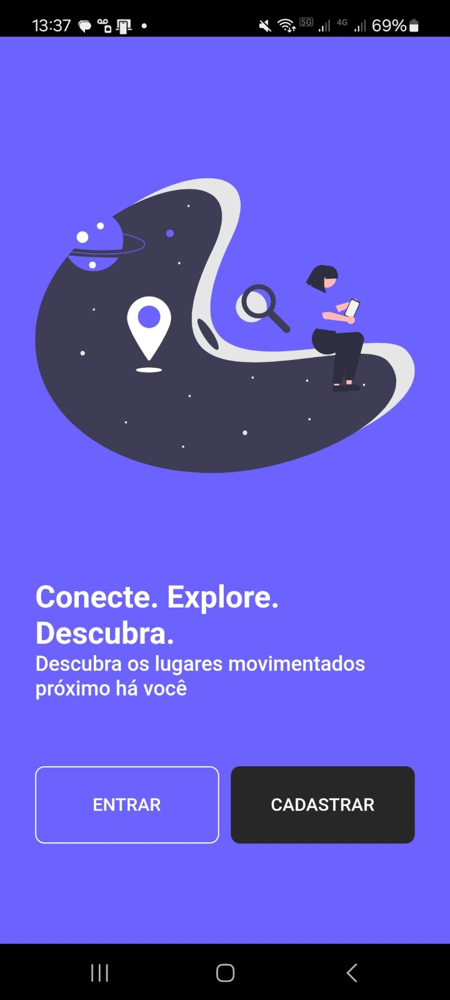
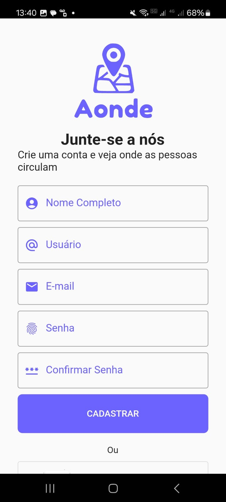
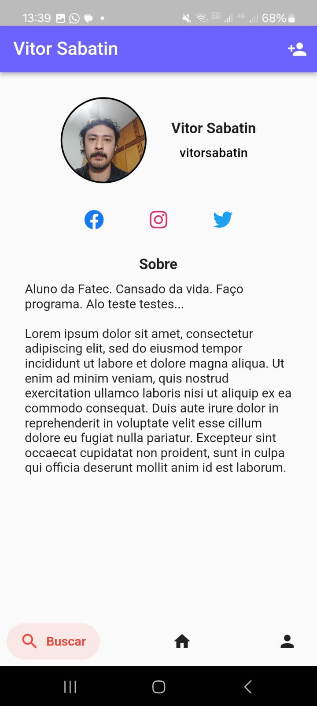
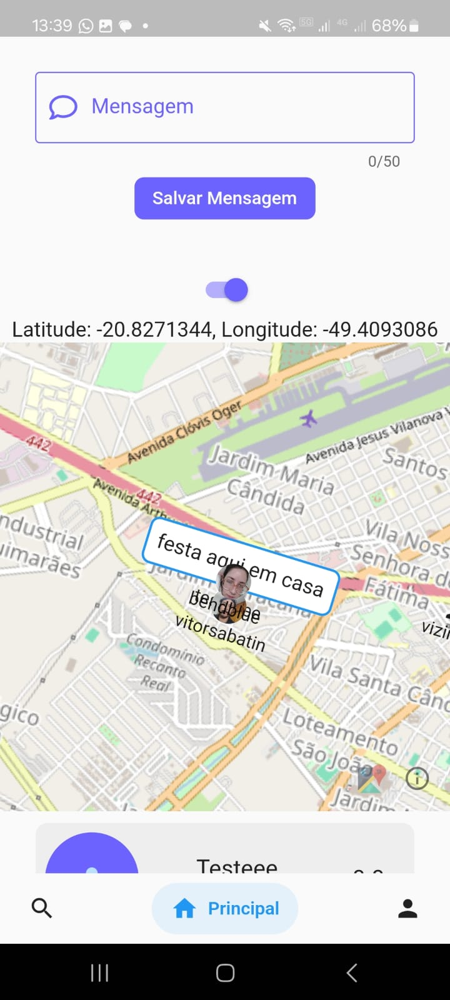

# aonde
*under construction*

I developed a mobile app with geolocation where users can drop a pin at their current location and leave a message for other users to see. 

I developed this app with the intention of learning Flutter and Firebase, so it is quite rough and simple. Here are some screens produced and their functionalities:

  
  
  
  

## Getting Started

This project is a starting point for a Flutter application.

A few resources to get you started if this is your first Flutter project:

- [Lab: Write your first Flutter app](https://docs.flutter.dev/get-started/codelab)
- [Cookbook: Useful Flutter samples](https://docs.flutter.dev/cookbook)

For help getting started with Flutter development, view the
[online documentation](https://docs.flutter.dev/), which offers tutorials,
samples, guidance on mobile development, and a full API reference.
